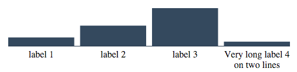

# EzCharts Alpha
Meteor generics and user friendly Charts package.

Alpha version, use at your own risk.


##Installation


```bash
$ meteor add lerayj:ez-charts
```
EzCharts is the simple and easy way to draw SVG charts. 
You don't need to have any knowledge or dive into deep understanding on SVG library.

Based on top of D3.chart, create your data-visualization in a second.


##QuickStart
Basically, you need only one line to make EzCharts to work:
```javascript
{{> EzChartBar width=widthTest height=heightTest data=dataTest name="BarChartCool"}}
```
*Tip*
Specify a name isn't necessary. It's just allow you to add a class directly on the root chart element.

##Full Example

Let's take a concrete example, with one template and his associated helper:
####hello.js


```javascript
Template.hello.helpers({
  dataTest: function () {
  var data = [
    {id: 0, name: "label 1", value: 50},
    {id: 1, name: "label 2", value: 120},
    {id: 2, name: "label 3", value: 310},
    {id: 3, name: "Very long label 4 on two lines", value: 25}
  ];
    return data;
  },
  widthTest: function(){return 500;},
  heightTest: function(){return 200;}
});
```

####hello.html


```javascript
<template name="hello">
{{> EzChartBar width=widthTest height=heightTest data=dataTest}}
</template>
```

####Render


That's it!


##Data Structures

###Bars

You should use  a collection structured as below.

One item's list represent one bar.

You could add item as much as you, but keep in mind the size of your chart if you don't want
to display horful labels!

```javascript
var data = [
  {id: 0, name: "label 1", value: 350},
  {id: 1, name: "label 2", value: 20},
  {id: 2, name: "label 3", value: 10},
  {id: 3, name: "label 4", value: 5}
];
```
### Lines

Same concept than above, you can dra as much line as you want on your chart.


```javascript
  var data = 
  [{
    id: 0,
    points: 
      [{
        id: 0,
        coord:[12, 46],
        label: "label 1"
        },{
        id: 1,
        coord:[24, 12],
        label: "label 2"
        },{
        id: 2,
        coord:[65, 75],
        label: "label 3"
        },{
        id: 3,
        coord:[87, 54],
        label: "label 4"
      }]
  }]
```

###Donut
Work in progress

```javascript
var data = 
[{
  id: 0,
  label: "Group 1",
  val: 459
},{
  id: 1,
  label: "Group 2",
  val: 200
},{
  id: 3,
  label: "Group 3",
  val: 100
}];
```
##Defaults Charts


##Colors and Styles
Work in progress


##Dependencies
EzCharts have only one direct dependency:
- agnito:d3-chart

It also have two core dependencies:
- templating
- underscore
